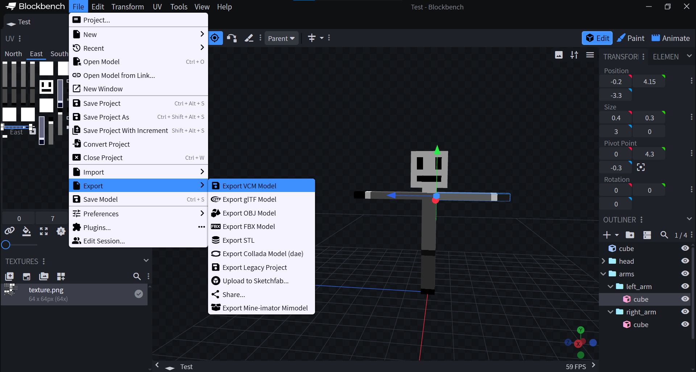
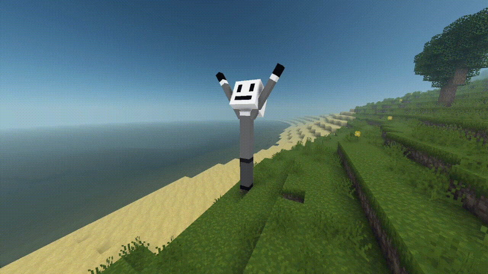

# Voxel Bench

Это плагин для [**Blockbench**](https://www.blockbench.net),
позволяющий экспортировать модели в формат `.vcm`
([Voxel Core](https://github.com/MihailRis/voxelcore) Model),
намного упрощая моделирование, риггинг и в целом интеграцию
моделей в **Voxel Core**.

## Как установить?
1) Откройте страницу [релизов](https://github.com/Onran0/voxelbench/releases);
2) Скачайте файл `voxelbench.js` с последнего релиза;
3) В **Blockbench** нажмите `File -> Plugins -> Import from File`
и выберите скачанный файл.

## Как использовать?

Просто нажмите `File -> Export -> Export VCM Model` и выберите файл,
в который вы хотите экспортировать `.vcm` модель.

## Как сбилдить?

### Гайд для WebStorm

1) Склонируйте репозиторий через интерфейс;
2) Откройте проект **VoxelBench**;
3) Пропишите в терминал `npm run build`;
4) Используйте билд плагина, находящийся по пути `dist/voxelbench.js`.