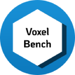
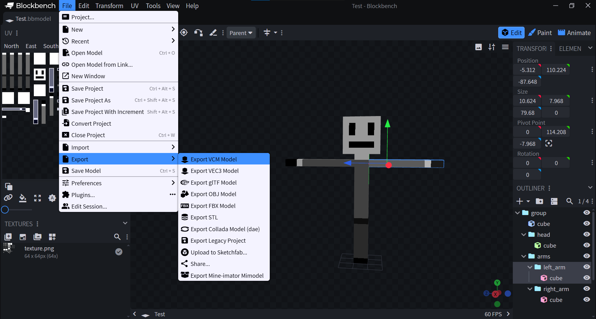

#  Voxel Bench

[Russian README](README-ru.md)

This is a plugin for [**Blockbench**](https://www.blockbench.net),
allowing you to export models to the `.vcm` and `.vec3` formats,
greatly simplifying modeling, rigging, and overall integration
of models into **[Voxel Core](https://github.com/MihailRis/voxelcore)**.

## How to install?
1) Open the [releases](https://github.com/Onran0/voxelbench/releases) page;
2) Download the `voxelbench.zip` file from the latest release;
3) Unzip the archive to any folder;
4) In Blockbench, click `File -> Plugins -> Load plugin from File`
   and select `voxelbench.js` in the unzipped folder.

## How to use?

Simply click `File -> Export -> Export VCM/VEC3 Model` and select the file
to which you want to export the model.

## How to build?

### WebStorm Guide

1) Clone the repository through the interface;
2) Open the VoxelBench project;
3) Type `npm run build` in the terminal;
4) Use the plugin build located at `dist/voxelbench/voxelbench.js` relative to the project root.