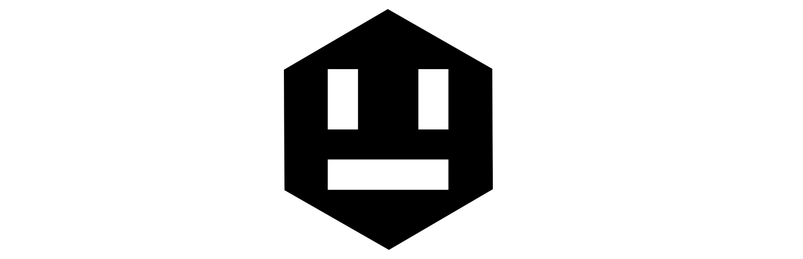
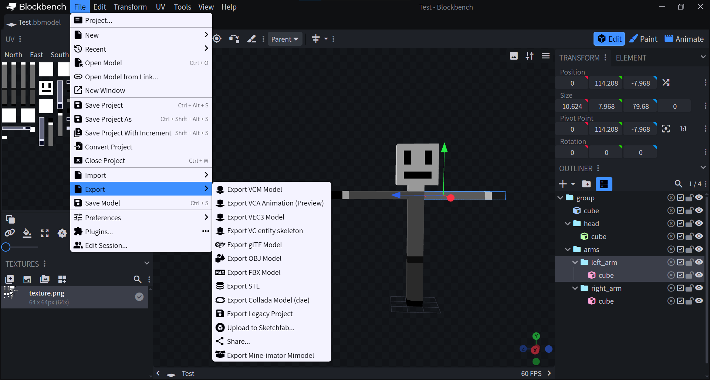
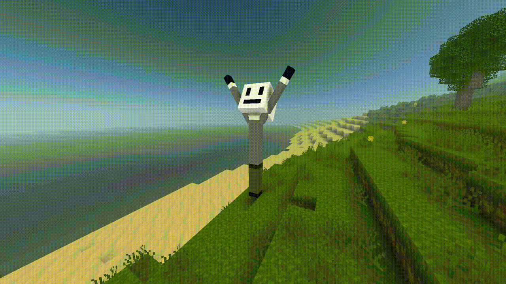

    

---

[Russian README](README-ru.md)

This is a plugin for [**Blockbench**](https://www.blockbench.net)
that allows you to export models and animations to **[voxelcore](https://github.com/MihailRis/voxelcore)** formats
(`.vec3` and `.vcm` for models, `.vca` for animations, and `.json` for skeletons),
greatly simplifying modeling, animation, and rigging.

## How to install?
1) Open the [releases](https://github.com/Onran0/voxelbench/releases) page;
2) Download the `voxelbench.zip` file from the latest release;
3) Unzip the archive to any folder;
4) In Blockbench, click `File -> Plugins -> Load plugin from File`
   and select `voxelbench.js` in the unzipped folder.

## How to use?

### For Models

Click `File -> Export`, select the appropriate format (`VCM` or `VEC3`), and configure the exporter settings
to suit your needs (if necessary). If you choose `VEC3` and are exporting a model for a skeletal entity,
remember to export the `.json` skeleton separately using the `Export VC entity skeleton` button.

### For Animations

Click `File -> Export` and select the `VCA` format. In the dialog box, select the desired animation (yes, each animation
must be exported individually, as the format does not support batch exporting). You also have the option to enable
**animation baking**. This can result in a more visually accurate animation if you notice artifacts in standard mode,
but keep in mind that it significantly increases the file size.

## How to build?

### WebStorm Guide

1) Clone the repository through the interface;
2) Open the **Voxelbench** project;
3) Type `npm run build` in the terminal;
4) Use the plugin build located at `dist/voxelbench/voxelbench.js` relative to the project root.